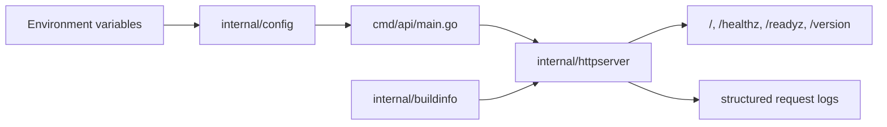

# go-service-starter

[](https://go.dev/)
[](./LICENSE)
[](https://github.com/happysnaker/go-service-starter/stargazers)
[](https://happysnaker.github.io/support/)
[](https://happysnaker.github.io/review/)

A minimal but production-minded **Go HTTP service starter** for backend engineers who want a clean service baseline without adopting a heavyweight framework.

This repo is intentionally small enough to understand in one sitting, but structured enough to feel like the beginning of a real internal service.

- Project page: [happysnaker.github.io/go-service-starter](https://happysnaker.github.io/go-service-starter/)

## Why this starter exists

Many Go starter repos fall into one of two buckets:

- they are too tiny to reuse outside a tutorial
- they ship so much scaffolding that you are effectively adopting a framework

`go-service-starter` aims for a middle ground:

- **standard-library first**
- **clear service boundaries**
- **sane operational defaults**
- **easy to extend for real backend work**

## What you get

- HTTP server based on `net/http`
- environment-based configuration loading
- structured JSON logging with `log/slog`
- `healthz`, `readyz`, and `version` endpoints
- graceful shutdown on `SIGINT` / `SIGTERM`
- build metadata placeholders for versioned delivery
- lightweight layout for internal APIs and small services

## Architecture at a glance



See also: [`docs/architecture.md`](./docs/architecture.md)

## Project layout

```text
cmd/api/                    service entrypoint
internal/config/            env config loading and defaults
internal/httpserver/        routes, server wiring, request logging
internal/buildinfo/         version / commit / builtAt placeholders
configs/service.env.example example local env file
docs/                       architecture and hardening notes
Dockerfile                  minimal container build
Makefile                    common local commands
```

## Endpoints

| Endpoint | Purpose |
| --- | --- |
| `GET /` | basic service response |
| `GET /healthz` | liveness signal |
| `GET /readyz` | readiness signal |
| `GET /version` | build metadata placeholder |

## Quick start

```bash
cp configs/service.env.example .env
set -a && source .env && set +a
go run ./cmd/api
```

Then hit the service:

```bash
curl http://localhost:8080/
curl http://localhost:8080/healthz
curl http://localhost:8080/readyz
curl http://localhost:8080/version
```

## Docker

```bash
docker build -t go-service-starter:dev .
docker run --rm -p 8080:8080 --env-file configs/service.env.example go-service-starter:dev
```

## When to use this

This starter is a good fit when you want:

- a clean baseline for a small backend service
- a teaching repo for Go service structure
- a lightweight internal API template
- a foundation you can grow into metrics, tracing, auth, and persistence

It is **not** trying to be:

- a batteries-included platform framework
- a complete microservice platform
- an opinionated replacement for your whole internal stack

## Production hardening roadmap

Good next additions for a serious service:

- request IDs and panic recovery middleware
- metrics / tracing / pprof endpoints
- configuration validation and startup checks
- authn / authz middleware
- persistence wiring and dependency boundaries
- background workers and drain handling
- CI, releases, and deployment manifests

See [`docs/production-hardening.md`](./docs/production-hardening.md) for a more complete checklist.

## Related repos

If you like this repo, you may also want:

- [`go-http-middleware-kit`](https://github.com/happysnaker/go-http-middleware-kit) — reusable `net/http` middleware for request IDs, structured logs, panic recovery, and timeouts
- [`backend-engineer-checklist`](https://github.com/happysnaker/backend-engineer-checklist) — a practical roadmap for backend, systems, and distributed-systems fundamentals
- [`system-design-checklist`](https://github.com/happysnaker/system-design-checklist) — a practical framework for interviews, design reviews, and distributed-systems tradeoffs

## Support

If this starter saves you time, consider:

- starring the repo
- sharing it with other backend engineers
- supporting ongoing maintenance via the support page: [happysnaker.github.io/support](https://happysnaker.github.io/support/)
- if you want lightweight async feedback on a public GitHub profile, repo README, or portfolio page, details are also available on the support page

If this starter saved you setup time for a new service, small direct support is especially helpful.

Typical thank-you support amounts that fit this repo:

- **¥9.9** — if the README / layout saved you a detour
- **¥19.9** — if it helped you bootstrap a real internal service faster
- **best payment note** — `go-service-starter`
- **fastest path** — tip directly if this starter saved you setup time; use **¥29.9** / **¥99** only if you want feedback back
- **¥99** — if you want compact async feedback on your own public service repo / README

## License

MIT
