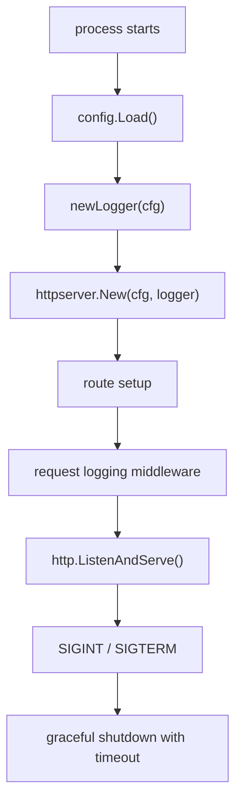

# Architecture notes

This starter intentionally keeps the first version small, dependency-light, and easy to reason about.

## Design goals

- clear entrypoint under `cmd/`
- env-based configuration with sensible defaults
- standard-library-first HTTP stack
- structured operational logging
- obvious health and version endpoints
- graceful shutdown by default
- easy extension path for real service concerns

## Current flow

## Responsibilities by package

### `cmd/api`

- process lifecycle
- signal handling
- top-level wiring

### `internal/config`

- load env vars
- parse duration values
- map log level strings to `slog.Level`

### `internal/httpserver`

- route registration
- server configuration
- request logging middleware
- JSON response helpers

### `internal/buildinfo`

- placeholder build metadata
- values that can be injected at release/build time

## Extension points

Natural places to grow this starter:

- middleware for request IDs, recovery, auth, and rate limiting
- `internal/` domain modules for business logic
- database and cache wiring behind clear boundaries
- metrics, tracing, and debug endpoints
- separate admin or internal-only listeners
